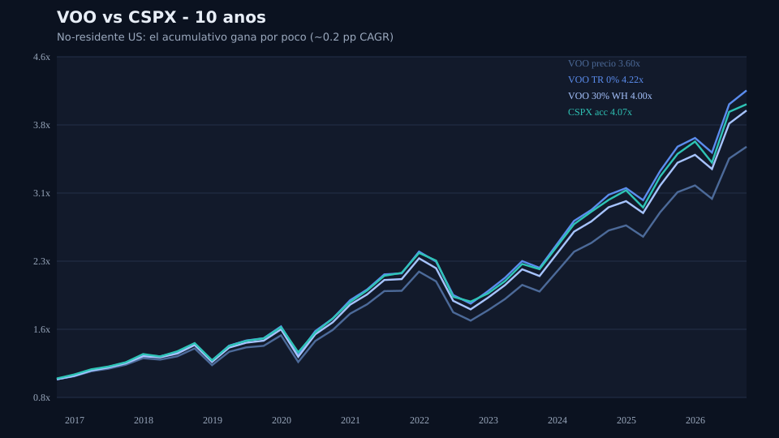
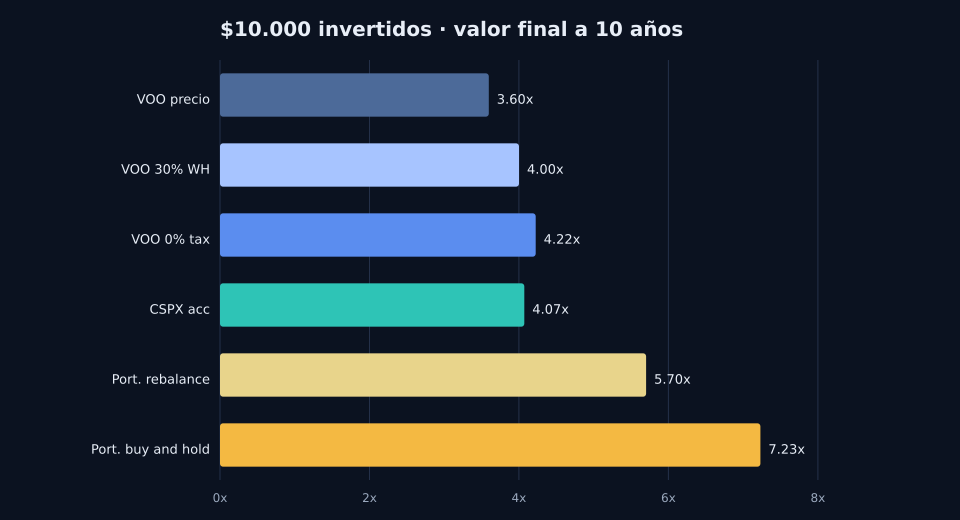
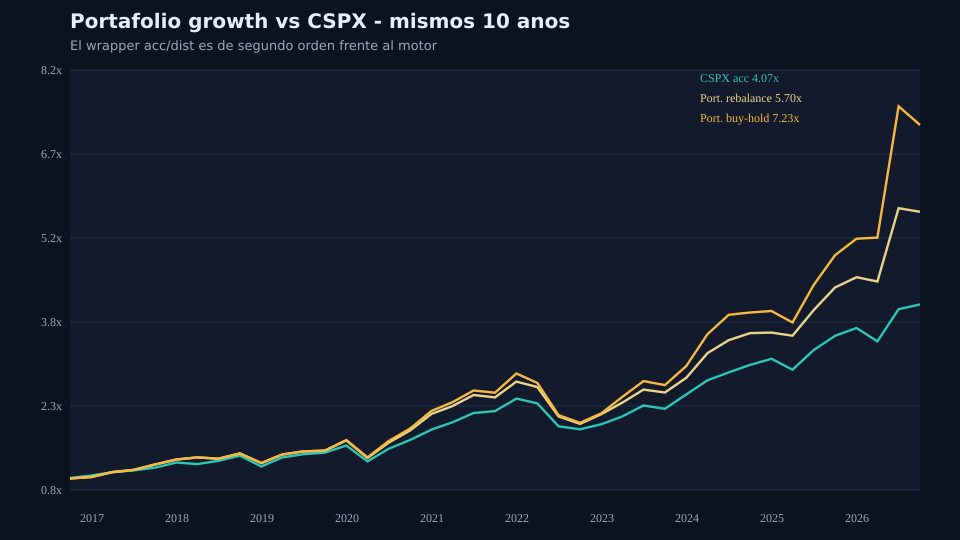

# VOO vs CSPX: distributivo con retención a no-residentes vs acumulativo

Backtest de 10 años (21 sep 2016 → 21 sep 2026) para responder una pregunta recurrente en **Latinoamérica y Europa**:

> ¿Rinde más un ETF distributivo del S&P 500 (VOO) o su versión UCITS acumulativa (CSPX)?

La respuesta corta para un **inversionista no-residente de EE. UU.**: **CSPX gana, pero por muy poco**. El wrapper (acumular vs distribuir) es un ajuste de segundo orden. Lo que mueve el múltiplo es el motor del portafolio.

No es asesoría fiscal, legal ni de inversión. La retención del 30% es ilustrativa (withholding típico de EE. UU. sin tratado). Un UCITS irlandés como CSPX suele retener ~15% *dentro* del fondo.

## Resultados (corrida del 2026-09-21)

Ventana alineada: **2016-09-21 → 2026-09-21**. Precios Yahoo Finance. CSPX.L cotiza en USD.

### 1. VOO vs CSPX con impuesto a no-residentes

| Serie | Múltiplo | CAGR | Max DD | $10.000 → |
|---|---:|---:|---:|---:|
| VOO solo precio (no reinviertes dividendos) | 3.60x | 13.7% | −34.3% | $35.968 |
| **VOO + dividendos con 30% de retención US** | **4.00x** | **14.9%** | −34.1% | **$40.010** |
| **CSPX acumulativo** | **4.07x** | **15.1%** | −33.9% | **$40.709** |
| VOO + dividendos a 0% de impuesto (referencia US) | 4.22x | 15.5% | −34.0% | $42.242 |

Qué implica:

- Si **no reinviertes** el dividendo de VOO, CSPX gana claro (4.07x vs 3.60x).
- Si eres **no-residente** y te retienen ~30% del dividendo, CSPX gana por **~0.2 pp de CAGR**. Sobre $10.000, unos **$700** en 10 años.
- Si pudieras reinvertir VOO **sin impuesto**, VOO gana por TER más bajo (0.03% vs 0.07% de CSPX) y porque CSPX ya trae withholding interno.

El debate acc vs dist **sí importa** para no crear evento fiscal y para no gastar el dividendo. No decide si tu capital se multiplica por 4 o por 7.





### 2. El mismo periodo vs un portafolio growth

Pesos al 21 sep 2026 de la cuenta eToro de [@Andalejo1109](https://www.etoro.com/people/andalejo1109):

| Activo | Peso |
|---|---:|
| SPYG | 31.3% |
| SMH | 21.3% |
| BRK.B | 20.0% |
| IEMG | 19.9% |
| VTI | 7.5% |

| Serie | Múltiplo | CAGR | Max DD | $10.000 → |
|---|---:|---:|---:|---:|
| CSPX acumulativo | 4.07x | 15.1% | −33.9% | $40.709 |
| Portafolio con rebalance anual | 5.70x | 19.0% | −31.2% | $57.010 |
| Portafolio buy & hold (pesos de hoy) | 7.23x | 21.9% | −33.0% | $72.311 |

Componentes (total return): SMH 19.40x · SPYG 5.24x · VTI 4.02x · BRK.B 3.43x · IEMG 2.39x.



Animación (generada al correr el script): `output/portfolio_vs_cspx.gif`

### Lectura sobria

- **Look-ahead:** los pesos de hoy están inflados por el ganador. SMH no pesaba 21% en 2016. Por eso el rebalance anual (5.70x) es la cifra más honesta.
- **Sin SMH** el resto del mix queda cerca de CSPX (~3.9x). El gap no “anula” al acumulativo; muestra que la **exposición a growth/semis** de esta década pesó más que el folleto del ETF.
- SMH tuvo un drawdown máximo de **−45%** vs **~−34%** del S&P. Más retorno, camino más irregular.
- Costos de eToro, spreads, residencia fiscal y tu disciplina con el dividendo cambian el neto.

## Cómo correrlo

```bash
python3 -m venv .venv
source .venv/bin/activate
pip install -r requirements.txt
python backtest.py
```

Salida en `output/`:

- `voo_vs_cspx.png|svg`
- `portfolio_vs_cspx.png|svg|gif`
- `multiples_bar.png|svg`
- `stats.csv`, `series.csv`

## Metodología

1. **VOO precio:** `Close` sin dividendos.
2. **VOO TR 0%:** `Adj Close` (reinversión total, sin impuesto).
3. **VOO TR 30%:** dividendos históricos de VOO, withholding `1 - 0.30`, recompra al cierre del día ex-dividendo (o el siguiente hábil).
4. **CSPX:** `Adj Close` de `CSPX.L` (USD). Fondo acumulativo; el precio ya incorpora la reinversión interna.
5. **Portafolio buy & hold:** pesos actuales × total return de cada ticker.
6. **Portafolio rebalance:** mismos pesos, rebalance el último día hábil de cada año.

Constantes en `backtest.py`: `START`, `NONRESIDENT_WH = 0.30`, `VALUES`.

## Disclaimer

Backtest hipotético. Rentabilidades pasadas no predicen rentabilidades futuras. No es una recomendación de compra/venta de VOO, CSPX ni de ningún componente del portafolio. Consulta un contador en tu país antes de elegir wrapper fiscal.
